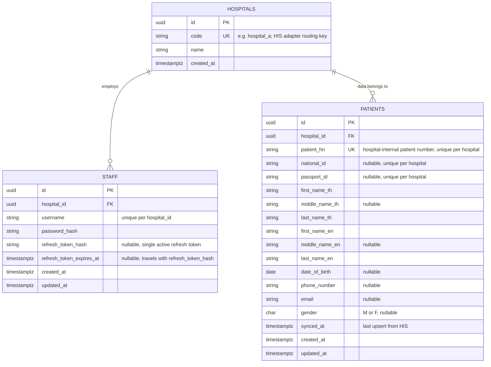

# ER Diagram — Hospital Middleware

## Diagram



## Why a `hospitals` table exists at all

`hospital` shows up as a plain string in the scope's API inputs (`/staff/create`, `/staff/login`), but it's modeled as a real table rather than a free-text column, for two reasons:

1. **`code` is the stable key the `his` adapter registry routes on** (`hospital_a` -> `hospitala.Client`). Decoupling that routing key from a human-readable `name` means renaming a hospital in the UI never breaks adapter lookup, and it gives `/staff/create` something concrete to validate against (`422 UNKNOWN_HOSPITAL` from the API spec).
2. Both `staff.hospital_id` and `patients.hospital_id` are foreign keys into it — this is what makes "staff can only search patients in their own hospital" an actual referential-integrity-backed constraint plus a `WHERE hospital_id = :staff_hospital_id` filter, rather than a string-equality comparison prone to typos/case mismatches.

## Table notes

**`staff`**
- `UNIQUE (hospital_id, username)` — per api-spec.md Assumption 2, uniqueness is scoped per hospital, not global.
- `password_hash` — bcrypt, never the plaintext.
- `refresh_token_hash` — nullable single column, not a separate sessions table, per the "no rotation/blacklist infra" simplification already noted in api-spec.md Assumption 3.
- `refresh_token_expires_at` — travels with `refresh_token_hash` (both null, or both set); without it there'd be no way to actually enforce the 7-day refresh token lifetime api-spec.md commits to.

**`patients`**
- Column set is a direct, compatible superset of Hospital A's response body (`first_name_th`...`gender`), plus `hospital_id`, `synced_at`, and audit timestamps that no HIS provides but the middleware needs.
- `national_id` and `passport_id` are both nullable because Hospital A's contract allows lookup by either one — a given patient record may only have one of the two populated.
- `patient_hn` is `NOT NULL` — every patient row originates from a HIS sync, and Hospital A's contract always includes it — so it takes a plain (non-partial) unique constraint:
  ```sql
  ALTER TABLE patients ADD CONSTRAINT uq_patients_hospital_patient_hn
    UNIQUE (hospital_id, patient_hn);
  ```
- `national_id`/`passport_id` uniqueness is enforced as **partial unique indexes**, scoped per hospital, only where the value is non-null (unlike `patient_hn`, either one may legitimately be absent):
  ```sql
  CREATE UNIQUE INDEX uq_patients_hospital_national_id
    ON patients (hospital_id, national_id) WHERE national_id IS NOT NULL;
  CREATE UNIQUE INDEX uq_patients_hospital_passport_id
    ON patients (hospital_id, passport_id) WHERE passport_id IS NOT NULL;
  ```
  These, together with `patient_hn`, are the dedupe keys the `search_patient` usecase upserts against when a HIS lookup-by-id returns a record not yet cached locally.
- `synced_at` tracks freshness of HIS-sourced data — not required by the scope, but cheap and useful metadata once the table is acting as a local cache/index rather than a pure system of record.

## Indexes for search

Beyond the unique constraints above (which also serve as lookup indexes for `patient_hn`, `national_id`, `passport_id`):
- `CREATE INDEX ON patients (hospital_id, phone_number);`
- `CREATE INDEX ON patients (hospital_id, email);`
- Name search (`first_name`/`last_name`, TH or EN) uses `ILIKE` for the scope. A `pg_trgm` GIN index would be the natural upgrade for fuzzy/partial name search at real scale — **explicitly not built now**, noted here as a known future enhancement rather than left unmentioned, consistent with how `/event`+`/audit`'s scope was handled.

## Relationship to the other docs

- `hospitals.code` is what `"hospital": "hospital_a"` in `api-spec.md` / `openapi.yaml` refers to.
- This is the schema `docs/project-structure.md`'s `postgres` package implements `patient.Repository` and `staff.Repository` against.
- This is `/migrations/000001_init.up.sql` (`golang-migrate` naming), verbatim.
